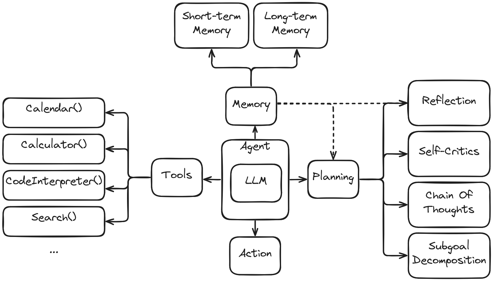
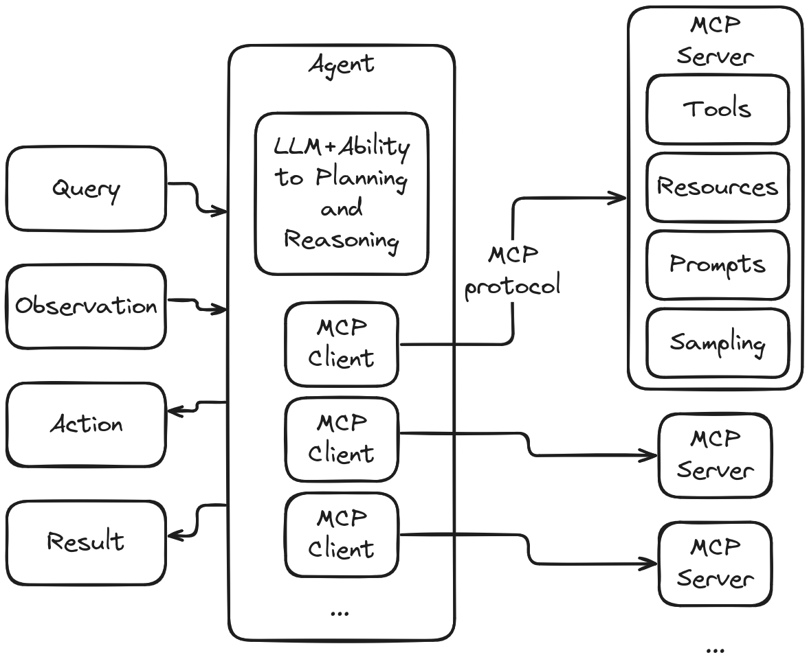

<h1 align="center">Agent Engineering Handbook</h1>

*Gather a broad range of aspects and resources (frameworks, libraries, tools, etc.). Choose the most representative ones, learn just enough to build something, then practice until you can see beyond the details to the underlying patterns.*
 

<em>Figure 1 – A generic agent architecture.</em>

<em>Figure 2 – An AI-agent stack that uses Model Context Protocol for unified context (tools, memory, docs).</em>

## 📚 General Resources

- **[Hugging Face Learn](https://huggingface.co/learn)**: Tutorials and courses on a wide range of ML topics.
- **[Hugging Face Docs](https://huggingface.co/docs)**: Official documentation for Hugging Face libraries and tools.
- **[Hugging Face Spaces](https://huggingface.co/spaces)**: A platform to build, share, and host ML demos.

## 🧠 Large Language Models (LLM)

- **[Hugging Face LLM Course](https://huggingface.co/learn/llm-course)**: A free course on Large Language Models.
- **[smol-course](https://github.com/huggingface/smol-course)**: A small, focused course on LLMs from Hugging Face.
- **[smollm](https://github.com/huggingface/smollm)**: A repository related to the smol-course.
- **[smollm Collection](https://huggingface.co/collections/HuggingFaceTB/smollm-6695016cad7167254ce15966)**: A Hugging Face collection of models and datasets for the smollm course.
- **[DSPy](https://dspy.ai/)**: A declarative framework for building modular AI software.

## 🤖 AI Agents

- **[Hugging Face Agents Course](https://huggingface.co/learn/agents-course)**: A course dedicated to building AI agents.
- **[smolagents Docs](https://huggingface.co/docs/smolagents)**: Documentation for the smolagents library.
- **[smolagents GitHub](https://github.com/huggingface/smolagents)**: The source code for the smolagents library.
- **[Why LangGraph?](https://langchain-ai.github.io/langgraph/concepts/why-langgraph/)**: An introduction to the concepts behind LangGraph.
- **[LangGraph GitHub](https://github.com/langchain-ai/langgraph)**: A library for building stateful, multi-actor applications with LLMs.

## 🤝 Protocols
- **[A2A Github](https://github.com/a2aproject/A2A)**: The official repository of the Agent-to-Agent (A2A) communication protocol.
- **[A2A Project](https://a2aproject.github.io/A2A/v0.2.5/)**:  Comprehensive documentation for understanding and implementing A2A.
- **[ACP](https://github.com/i-am-bee/acp)**:  The Agent Communication Protocol (ACP) source code repository.
- **[ACP Document](https://agentcommunicationprotocol.dev/introduction/welcome)**:  Introduction and technical overview of ACP.
- **[Hugging Face MCP Course](https://huggingface.co/learn/mcp-course)**: Learn about the Model Context Protocol.
- **[MCP Introduction](https://modelcontextprotocol.io/introduction)**: The official introduction to MCP.
- **[Python SDK for MCP](https://github.com/modelcontextprotocol/python-sdk)**: The official Python SDK for MCP.
- **[MCP Servers](https://github.com/modelcontextprotocol/servers)**: Implementations of MCP servers.
- **[MCP Servers Hub](https://mcpservers.org/)**: A place to discover and share MCP servers.
- **[MCP Market](https://mcpmarket.com/)**: A place to discover and share MCP servers.

## 📊 Evaluation & Monitoring

- **[MLflow](https://mlflow.org/)**: An open-source platform to manage the ML lifecycle, including experimentation, reproducibility, and deployment.
- **[MLflow GitHub](https://github.com/mlflow/mlflow)**: The source code for MLflow.
- **[Arize Phoenix Docs](https://arize.com/docs/phoenix)**: Documentation for Phoenix, an open-source ML observability library.
- **[Phoenix GitHub](https://github.com/Arize-ai/phoenix)**: The source code for Arize Phoenix.

## 🎨 UI

- **[Gradio](https://www.gradio.app/docs)**: A library for building UIs for LLMs.
- **[Gradio GitHub](https://github.com/gradio-app/gradio)**: The source code for Gradio.

## 🌐 Engineering Resources

- **[Engineering Resources](./docs/engineering_resources.md)**: A collection of resources for building AI agents and Large Language Models.
- **[MCP Hub](https://github.com/iteam1/mcp-hub)**: A centralized repository for Model Context Protocol (MCP) projects.
- **[ACP Hub](https://github.com/locchh/acp-hub)**: A centralized repository for Agent Communication Protocol (ACP) projects.
- **[A2A Hub](https://github.com/locchh/a2a-hub)**: A centralized repository for Agent to Agent Protocol (A2A) projects.
- **[LLM Playground](https://github.com/locchh/llm-playground)**: A collection of experiments with large language models across various NLP tasks.
